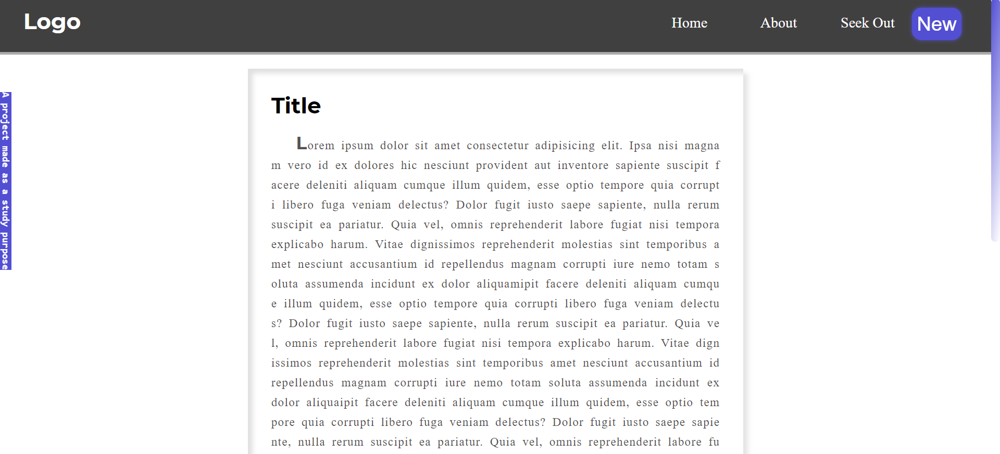

# :fire: HeaderPopUp 
- When the user scrolls down, the header disappear. On the other hand, if it scrolls up the screen, the header pops up with an neat animation

- [x] Add the vanish and appear of the Header using JavaScript
- [ ] Use Sass and arrange the files like it was components
- [x] Add media queries
- [x] Learn Something 

*Made with 💜*